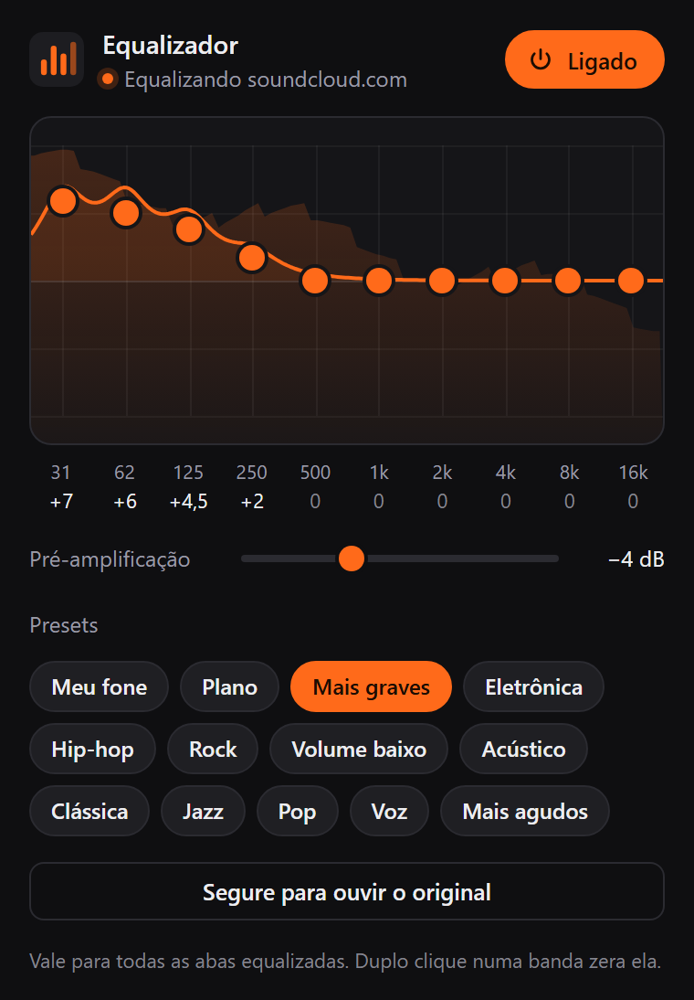

# Equalizador de Som

Equalizador de 10 bandas para o Chrome. Funciona no SoundCloud, no YouTube e em qualquer aba que esteja tocando som.

É de código aberto e pequeno o bastante para qualquer pessoa ler, e não esconde nada: não acessa sites, não se conecta à internet e não coleta dados.

<p align="center">
  
</p>

## Por que mais um equalizador?

Muitas extensões de equalizador pedem acesso a **todos os sites que você visita**. É esse tipo de permissão que extensões maliciosas usam para espionar a navegação, injetar anúncios ou roubar dados, e várias delas imitam ferramentas úteis como esta.

Esta extensão faz só o que promete, com o mínimo de permissões. E você pode conferir cada linha.

## O que ela pode e o que não pode fazer

**Permissões que ela pede, e para quê:**

| Permissão | Para que serve |
| --- | --- |
| `tabCapture` | Receber o som da aba em que você clicou em **Ligar**. Só dessa aba, e só depois do seu clique. |
| `offscreen` | Uma página invisível da própria extensão que processa o som e toca de volta. |
| `storage` | Guardar seus ajustes e presets no seu computador. |
| `activeTab` | Ao clicar no ícone, o Chrome libera por um momento a aba atual: o nome do site aparece no popup e a captura pode começar. |

**O que ela não tem, e o Chrome garante:**

- **Nenhum acesso a sites.** Não há `host_permissions` nem scripts injetados nas páginas, então ela não consegue ler o que você vê, digita ou acessa.
- **Nenhuma conexão com a internet.** A política de segurança no [`manifest.json`](manifest.json) (`connect-src 'none'`) proíbe a extensão de fazer qualquer requisição de rede. Nada sai do seu computador.
- **Nenhum código de fora.** Só roda o que está nesta pasta (`script-src 'self'`): sem rastreadores, analytics, anúncios ou scripts baixados.
- **Nenhuma dependência.** É HTML, CSS e JavaScript puros, sem bibliotecas e sem etapa de build. O código daqui é exatamente o que roda no seu navegador.
- **Nada é gravado.** O som é processado em tempo real e descartado. Não fica em arquivo nem sai da sua máquina.

### Confira você mesmo

1. Leia o [`manifest.json`](manifest.json): as permissões e a política de segurança estão lá, em poucas linhas.
2. Procure nos arquivos `.js` por `fetch`, `XMLHttpRequest`, `WebSocket` ou `http`. O único resultado é um texto em `popup.js` que reconhece o endereço da Chrome Web Store, onde o Chrome não permite equalizar. Não há nenhuma conexão.
3. Depois de instalar, abra `chrome://extensions`, clique em **Detalhes** no Equalizador de Som e veja as permissões que o próprio Chrome lista.

> **Instale só a partir deste repositório.** A extensão ainda não está na Chrome Web Store: qualquer versão com este nome em outro lugar não é daqui.

## Instalar

1. No topo desta página, clique em **Code → Download ZIP** e extraia o arquivo. Quem usa git pode clonar: `git clone https://github.com/gbinho/EqualizerForChrome.git`.
2. Abra `chrome://extensions` no Chrome.
3. Ligue o **Modo do desenvolvedor** (canto superior direito).
4. Clique em **Carregar sem compactação** e escolha a pasta extraída, a que contém o `manifest.json`.
5. Fixe o ícone na barra: ícone de quebra-cabeça 🧩 → alfinete ao lado de "Equalizador de Som".

Não apague nem mova a pasta depois de instalar, porque o Chrome carrega a extensão direto dela.

**Para atualizar:** baixe de novo, substitua a pasta e clique no botão de recarregar do card da extensão em `chrome://extensions`.

## Usar

1. Abra o SoundCloud ou o YouTube e dê play.
2. Clique no ícone do equalizador e depois em **Ligar**. O ícone ganha o selo **EQ** nessa aba.
3. Clique num preset para trocar o som na hora. Os que reforçam graves vêm primeiro, e **Plano** volta ao neutro.
4. Ou arraste as bolinhas (a rodinha do mouse em cima delas também funciona). Duplo clique volta a banda para 0. Gostou do resultado? Clique em **Salvar ajuste** para virar um preset seu.
5. Segure **Segure para ouvir o original** para comparar com o som sem efeito.

Os ajustes valem para todas as abas equalizadas e ficam salvos. Para desligar numa aba, abra o popup e clique em **Ligado**.

## Como funciona

```
aba (SoundCloud, YouTube…) ──tabCapture──▶ página invisível da extensão
   pré-amplificação ▶ 10 filtros (31 Hz a 16 kHz) ▶ limitador ▶ alto-falante
                                              └▶ analisador ▶ espectro no popup
```

- O som da aba passa pela [Web Audio API](https://developer.mozilla.org/pt-BR/docs/Web/API/Web_Audio_API) numa página invisível (`offscreen.html`) e volta para o alto-falante já equalizado.
- Cada banda é um filtro `peaking` de uma oitava. No fim da cadeia, um limitador evita distorção quando você sobe muito os graves.
- A curva do popup é a resposta real desses filtros (`getFrequencyResponse`), e o espectro é o som ao vivo depois do equalizador. O que aparece na tela é o que você ouve.

## Bom saber

- Enquanto uma aba está equalizada, o Chrome mostra nela um indicador de captura de áudio. É o jeito que ele avisa que uma extensão está processando o som.
- Páginas internas (`chrome://`, Chrome Web Store) não podem ser equalizadas.
- Se distorcer mesmo com o limitador, baixe a **Pré-amplificação**.
- Recarregar a extensão em `chrome://extensions` desliga o equalizador em todas as abas. É só ligar de novo.
- Requer Chrome 124 ou mais recente.

## Arquivos

| Arquivo | Função |
| --- | --- |
| `manifest.json` | Configuração da extensão (Manifest V3): permissões e política de segurança |
| `eq.js` | Bandas, presets e filtros, compartilhados pelos outros arquivos |
| `background.js` | Liga e desliga a captura das abas e cuida do selo EQ |
| `offscreen.html` / `offscreen.js` | Página invisível que recebe o som da aba, aplica o equalizador e toca de volta |
| `popup.html` / `popup.css` / `popup.js` | A janelinha com o gráfico, os presets e o espectro ao vivo |

## Segurança

Achou um problema de segurança? Veja o [SECURITY.md](SECURITY.md).

## Licença

[MIT](LICENSE): use, estude, modifique e distribua à vontade.
